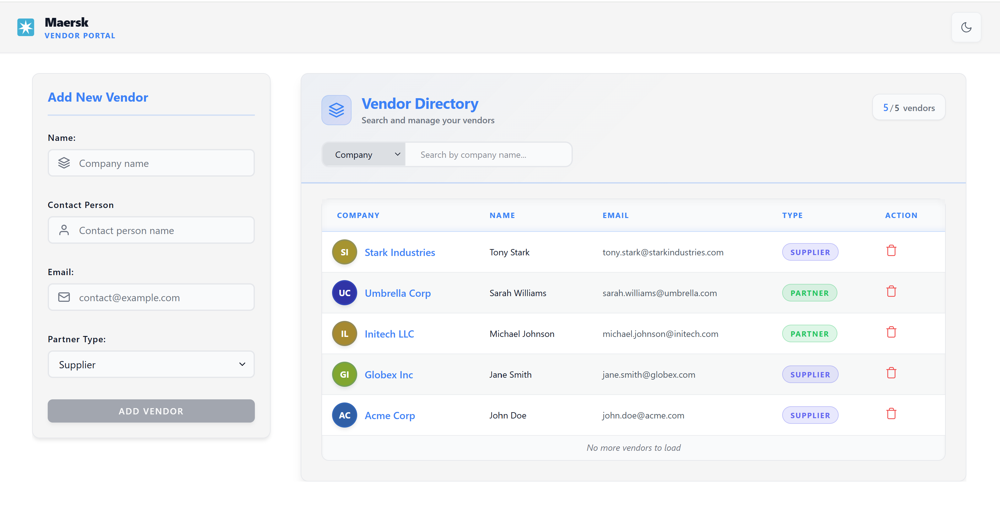
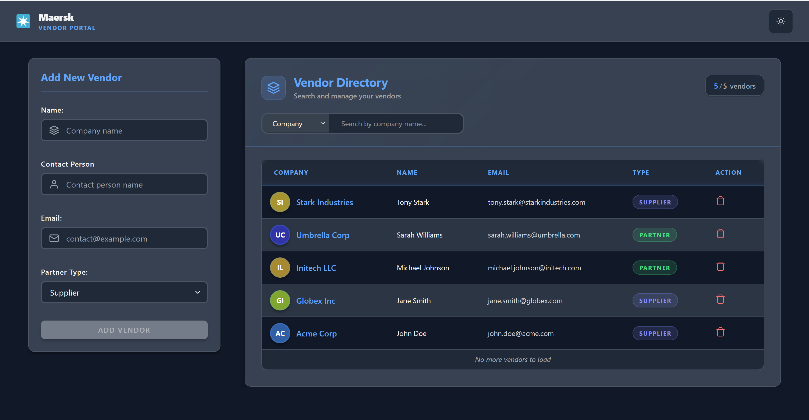
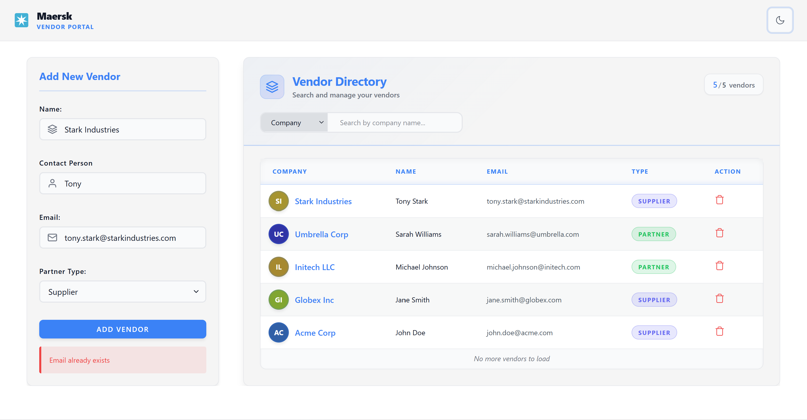

# Vendors Onboarding Portal

Full-stack Vendor Onboarding application for registering and managing vendors.

## Project overview

**Vendors Portal** lets users register vendors (name, contact person, email, partner type) and view or delete them. The app consists of:

- **Frontend** – Vue 3 + TypeScript + Vite, responsive layout, design tokens, light/dark theme
- **Backend** – Node.js (TypeScript) API with SQLite.

**Tech stack:** Vue 3, Vite, Pinia, Tailwind CSS, Node.js, Express, SQLite

---

## Quick start (local)

### Backend (Node.js)

```bash
cd backend-node
npm install
npm run dev
```

API: http://localhost:3000

### Frontend

```bash
cd frontend
npm install
npm run dev
```

App: http://localhost:5173 (Vite default). Configure backend in `frontend/src/services/VendorService.ts` (Node: port 3000).

---

## Docker Compose

Run the full stack (frontend + Node backend) in containers.

**Prerequisites:** Docker and Docker Compose installed.

1. From the **repository root**:

   ```bash
   docker compose build
   ```

2. Start the services:

   ```bash
   docker compose up -d
   ```

3. Access:
   - **Frontend:** http://localhost:4200
   - **Backend API:** http://localhost:3000

4. Stop:

   ```bash
   docker compose down
   ```

**Services:**

| Service  | Build context    | Port    | Description     |
| -------- | ---------------- | ------- | --------------- |
| backend  | `./backend-node` | 3000    | Node.js API     |
| frontend | `./frontend`     | 4200→80 | Vue app (nginx) |

Frontend is built with production API base URL targeting the backend service; for custom hosts or ports, adjust the frontend config or use env at build time.

---

## Repository structure

```
├── frontend/          # Vue 3 + Vite app
├── backend-node/      # Node.js (TypeScript) API – SQLite
├── docker-compose.yml # Frontend + Node backend
└── README.md
```

See each app’s README for details (run scripts, tests, Docker-only build, API docs).

---

## Implementation notes

### 1. Frontend UI polish

**Layout & responsiveness**

- Mobile-first responsive layout using CSS Grid and Flexbox.
- Single-column layout on mobile, multi-column layout on desktop.
- Breakpoints defined for comfortable spacing and readability across screen sizes.

**Lightweight design system**

- CSS variables in `frontend/src/style.css`:
  - **Colors:** primary, secondary, background, text, border
  - **Spacing:** consistent scale (xs → xl)
  - **Typography:** base font, heading scale, line-height
- Tokens reused across components for consistency and maintainability.

**Vendor list enhancements**

- Hover and focus states for interactivity
- Zebra striping for scanability
- Accessible empty state when no vendors are present

**Visual flourish**

- Light/dark theme toggle using a CSS-first approach (CSS variables + `data-theme` on `<html>`).
- Theme switching is fast, accessible, and does not rely on heavy JS logic.

**Accessibility**

- Focus states for keyboard navigation
- Sufficient color contrast in both themes
- Semantic HTML and ARIA-friendly patterns

### 2. Delete vendor

- Delete functionality to remove vendors from the system.
- Confirmation dialog before deletion to prevent accidental removal.
- Backend API supports vendor deletion (`DELETE /api/vendors/:id`).
- Frontend state updates immediately after successful deletion so the UI stays in sync.

### 3. UI bug fix – duplicate add

**Issue:** Clicking "Add" multiple times before the form reset could create API requests in parallel.

**Fix:**

- Submit button disabled while the request is in progress (`loadingAdd` or `isSubmitting`).
- Guard in `submitForm` to prevent multiple submissions.
- Form resets only after a successful backend response.

### 4. Unique emails

**Implementation**

- Email uniqueness enforced at the database level with a `UNIQUE` constraint on `vendors.email`.

**Reasoning**

- Email uniqueness is enforced at the database level to guarantee data integrity and prevent race conditions or duplicate records, even under concurrent requests. In addition, a frontend UX enhancement can be added where email uniqueness is checked on input blur (or keypress debounce) via a dedicated API, allowing users to receive early feedback if the email is already registered.

### 5. Containerization & deployment

**Docker & Docker Compose**

- Backend and frontend are containerized with Dockerfiles in `backend-node/` and `frontend/`.
- Docker Compose runs the full stack (frontend + Node backend) from the repository root.
- Enables straightforward local setup and aligns with typical deployment patterns.

See [Docker Compose](#docker-compose) above for build and run steps.

---

## Previews





---

### Additional Features

- **Unit Testing:** Implemented comprehensive unit tests covering major functional test cases to ensure robust code quality and reliability.
- **Search Vendor:** Developed a search functionality for vendors by both Company Name and Email on the frontend, with corresponding backend API support.
- **Infinite Scroll Pagination:** Frontend implements infinite scroll for the vendor list, efficiently loading more vendors as the user scrolls, ideal for large datasets.
- **Default Sorting:** Backend sorts vendors by creation date in descending order (most recently created first) by default.
- **ESLint:** Configured for both backend and frontend to maintain consistent code quality and catch potential errors. Run with `npm run lint`.
- **Prettier:** Auto-formatting tool to ensure consistent code style across the project. Format with `npm run format`.
- **Husky:** Git hooks integration to enforce code quality checks before commits. Pre-commit hooks automatically run linting and formatting checks before each commit, preventing code that doesn't meet quality standards from being committed.

### About Me

#### What I love most about being a software engineer

- What I love most is solving real problems through logic and creativity. Turning an idea or a requirement into something tangible that actually works — and seeing people use it — is deeply satisfying. I also enjoy the constant learning; technology evolves fast, and there’s always something new to explore, improve, or optimize.

#### What is most important to me when working in a team

- Clear communication and mutual respect matter the most to me. A strong team isn’t just about individual talent, but about collaboration, trust, and shared ownership. I value teams where people are open to feedback, willing to help each other, and focused on building the best solution rather than protecting egos.

#### The worst part of being a software engineer

- The hardest part is dealing with ambiguity and pressure — unclear requirements, or last-minute changes. Debugging issues that come from poor specifications or external dependencies can be frustrating. That said, these challenges also push me to become more patient, structured, and resilient.
